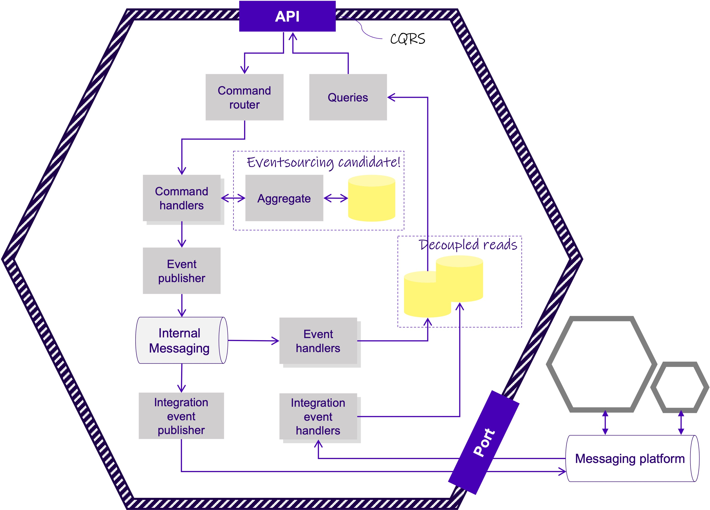

# Domain-driven Design use case: The Champagne Context (ChampagneBC)

Ideally, the solution should support the notion of [screaming architecture](http://blog.cleancoder.com/uncle-bob/2011/09/30/Screaming-Architecture.html) - architecture that from the shear look of the code makes it abundantly clear what it is about, where it does it, and how it does it. 

As Uncle Bob puts it: _"Your architectures should tell readers about the system, not about the frameworks you used in your system."_

## Overall architecture concept

The solution roughly consist of these components:

## Navigating the repo

The refactored code is located exclusively in the `src` folder (this folder). The remaining folders are unchanged from the original solution.

Use the main solution file [ChampagneBC.sln](ChampagneBC.sln) when opening the solution in your IDE.

## Important concepts

The solution displays a number of design choices:

* **The domain model** is the core of our software, and should not be spread across many different layers. It is therefore fully encapsulated in the [src/Domain](Domain) assembly
* Domain **validation logic** is implemented only once in [domain aggregates](https://martinfowler.com/bliki/DDD_Aggregate.html) and [value objects](https://martinfowler.com/bliki/ValueObject.html), making it easy to comprehend and test
* The solution supports **eventing** on top of a [Marten PostgreSQL database](https://martendb.io/). In order to clearly segregate mutations (arising from commands) and queries, the solution adopts [CQRS](https://martinfowler.com/bliki/CQRS.html) entirely to enable event publishing on distinct mutations. 
  * Commands are handled by Command Handlers in the [src/Commands](Commands) assembly
  * Queries are encapsulated in the [src/Projections](Projections) assembly
* **Events are published atomically** internally inside the [PublishingAggregateRepository](Domain.Persistence/PublishingAggregateRepository.cs)
* **Projections** (e.g., readmodels) are [eventually consistent](https://en.wikipedia.org/wiki/Eventual_consistency) by design, allowing for massive scalability on the read-side of the application.

## Getting started

The best way to get started is to read the unit test suites that outlines the invariants of the domain model: [src/Domain.UnitTests](Domain.Tests).

Another place to explore is defintely the [domain model itself](Domain/Aggregates/Champagne/Champagne.cs) and the [value objects](Domain/Aggregates/Champagne/ValueObjects) involved.

## Questions and suggestions?

Most certainly! Just create an issue or a PR in this repo.